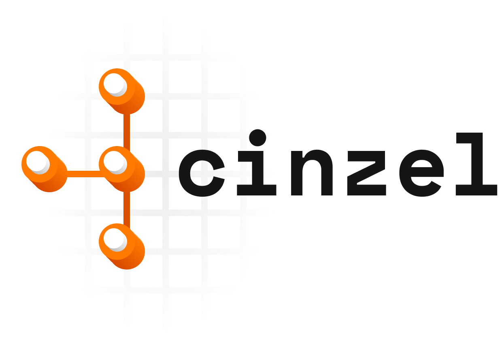

# cinzel



## Table of Contents

- [cinzel](#cinzel)
  - [Table of Contents](#table-of-contents)
  - [About](#about)
  - [Installation and usage](#installation-and-usage)
- [Providers](#providers)
  - [GitHub Actions](#github-actions)
  - [GitLab CI/CD Pipelines](#gitlab-cicd-pipelines)
  - [Changelog](#changelog)
  - [Code of Conduct](#code-of-conduct)
  - [Contributing](#contributing)
  - [License](#license)

## About

**`cinzel`**, pronounced as "*sin-ZEL*" ([IPA](https://en.wikipedia.org/wiki/International_Phonetic_Alphabet): /sĩˈzɛl/), is the Portuguese word for **chisel**.

It's a bidirectional converter between [HCL](https://github.com/hashicorp/hcl) and CI/CD pipeline [YAML](http://www.yaml.de), with provider-specific mappings (currently GitHub Actions and GitLab CI/CD).

Made with :heart: by [YLD Limited](https://www.yld.com/).

## Installation and usage

Install `cinzel` using one of these options:

- Download a prebuilt binary from [GitHub Releases][releases] (recommended for most users).
- Install with Homebrew:

```sh
brew tap yldio/cinzel
brew install --cask cinzel
```

- Install from source with Go:

```sh
go install github.com/yldio/cinzel@latest
```

Confirm installation:

```sh
cinzel --help
```

<!-- For more options on how to install, please go over to the [Wiki](https://github.com/yldio/cinzel/wiki). -->

### Quick start

Use the provider command shape:

```sh
cinzel <provider> parse --file <input.hcl> --output-directory <out-dir>
cinzel <provider> unparse --file <input.yaml> --output-directory <out-dir>
```

Example: GitHub Actions parse/unparse:

```sh
cinzel github parse --file ./test.hcl --output-directory .github/workflows
cinzel github unparse --file ./.github/workflows/test.yaml --output-directory ./cinzel
```

Example: GitLab CI/CD parse/unparse:

```sh
cinzel gitlab parse --file ./pipeline.hcl --output-directory .
cinzel gitlab unparse --file ./.gitlab-ci.yml --output-directory ./cinzel
```

Use `--dry-run` to print generated content to stdout.

For release operator details about Homebrew automation, see [`docs/release/homebrew.md`](docs/release/homebrew.md).

## Providers

Providers are the CI/CD platforms that `cinzel` can convert between HCL and YAML.

### GitHub Actions

See [`provider/github/README.md`](provider/github/README.md) for the full HCL schema reference and feature coverage.

### GitLab CI/CD Pipelines

See [`provider/gitlab/README.md`](provider/gitlab/README.md) for the GitLab HCL schema and conversion coverage.

## Changelog

Please visit the [Changelog](CHANGELOG.md) for more details.

## Code of Conduct

[](code_of_conduct.md)

Please check our [Code of Conduct](./CODE_OF_CONDUCT.md).

## Contributing

Contributions are welcome, as well as suggestions for `cinzel`. Please go over to the [Discussions](https://github.com/yldio/cinzel/discussions) first to understand the current state, features and issues before creating any issue or pull request. :heart:

Please make sure to update tests as appropriate.

## License

This project is licensed under the Apache-2.0 license. See [LICENSE](./LICENSE) for details.
