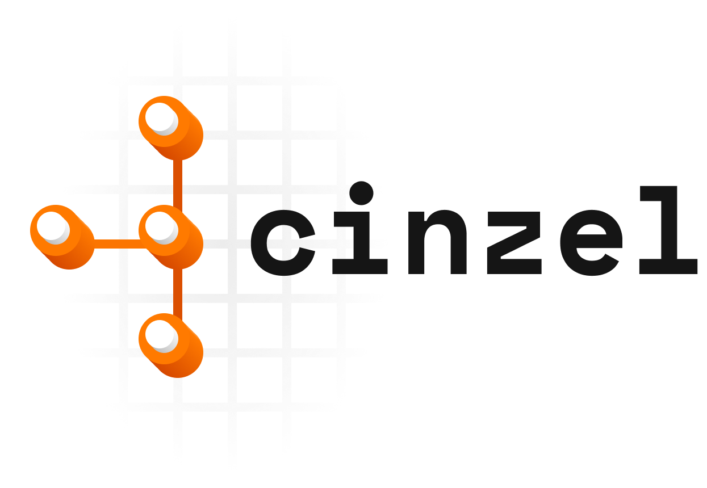

# cinzel



**`cinzel`**, pronounced "*sin-ZEL*" ([IPA](https://en.wikipedia.org/wiki/International_Phonetic_Alphabet): /sĩˈzɛl/), is the Portuguese word for **chisel**.

It converts CI/CD pipelines between [YAML](https://yaml.org) and
[HCL](https://github.com/hashicorp/hcl), in both directions, for GitHub Actions
and GitLab CI/CD.

Made with :heart: by [YLD Limited](https://www.yld.com/).

## Why

YAML pipelines grow by copy and paste. There is no way to say "this step, the
one I already wrote", so you write it again, and the fourth copy drifts from the
first.

HCL has references. A step is a block, and a job points at it by name:

```yaml
# .github/workflows/ci.yaml
jobs:
  build-and-test:
    runs-on: ubuntu-latest
    steps:
      - uses: actions/checkout@v4
      - name: Test
        run: go test ./...
```

```hcl
# cinzel/ci.hcl — the same job. Its step blocks sit further down the file.
job "build_and_test" {
  id = "build-and-test"

  runs_on {
    runners = "ubuntu-latest"
  }

  steps = [
    step.checkout,
    step.test,
  ]
}
```

`step.checkout` is a real reference. Rename the block and every job using it
follows. Write the step once and ten jobs can share it. GitHub and GitLab still
only read YAML, so cinzel converts back.

## Install

Download a binary from [Releases](https://github.com/yldio/cinzel/releases), or:

```sh
brew tap yldio/cinzel && brew install --cask cinzel
```

```sh
go install github.com/yldio/cinzel@latest
```

Then `cinzel --help`.

## Start from what you have

Point `unparse` at a pipeline you already run:

```sh
cinzel github unparse --file .github/workflows/ci.yaml --output-directory ./cinzel
cinzel gitlab unparse --file .gitlab-ci.yml --output-directory ./cinzel
```

Edit the HCL, then convert it back:

```sh
cinzel github parse --file ./cinzel/ci.hcl --output-directory .github/workflows
cinzel gitlab parse --file ./cinzel/.gitlab-ci.hcl --output-directory .
```

Add `--dry-run` to either to see the result without writing anything.

The two providers work the same way but their HCL differs, because the
platforms do:

- [GitHub Actions](provider/github/README.md) — workflows, composite actions,
  and the step reference graph.
- [GitLab CI/CD](provider/gitlab/README.md) — jobs, templates, includes, and
  the pipeline keywords.

## Flags

`parse` and `unparse` share these:

| Flag | Description |
| --- | --- |
| `--file`, `-f` | Read one file. |
| `--directory`, `-d` | Read every matching file in a directory. Not with `--file`. |
| `--recursive`, `-r` | Walk subdirectories of `--directory`. |
| `--output-directory` | Where to write. Parse defaults to `.github/workflows` (GitHub) or the working directory (GitLab); unparse defaults to `./cinzel`. |
| `--dry-run` | Print instead of writing. |

`parse` also takes `--yml` to write `.yml` instead of `.yaml`. GitLab parse
always writes `.gitlab-ci.yml`, so it changes nothing there.

## Defaults in a file

Put the flags you always pass into `.cinzelrc.yaml` and stop typing them:

```yaml
github:
  parse:
    directory: ./cinzel
    output-directory: .github/workflows
    yml: false
```

A flag on the command line still wins. It covers `parse` and `unparse` only,
per provider — `assist`, `pin`, `upgrade` and `init` ignore it. The keys are
`file`, `directory`, `output-directory` and, for parse, `yml`; anything else,
`recursive` included, prints `warning: ...: unknown key` and is skipped.

Paths must be relative and written with forward slashes. The file is meant to
be committed and read on every machine that checks the repo out, so an absolute
path or a leading `~` is refused with an error naming the key. Forward slashes
are converted to whatever the running system separates with, so one spelling
works on Linux, macOS and Windows.

## Generating a pipeline from a prompt

```sh
cinzel github assist --prompt "golang PR with tests and linting"
```

This asks an LLM for a pipeline, converts it through the same unparse path your
own YAML goes through, and writes HCL to a timestamped folder. Blocks matching
HCL you already have are replaced with a `// reuses:` comment rather than
duplicated. For GitHub, action versions are pinned to SHAs on the way out.

```
cinzel/assist/
  20260317-150405/     # first prompt
    assist.hcl
  20260317-151200/     # second prompt
    assist.hcl
```

Refine what came back, against the latest session or a named one:

```sh
cinzel github assist --refine "add slack notification on failure" --prompt "add to PR workflow"
cinzel github assist --refine "add caching" --from 20260317-150405
```

It needs an API key, read from the environment:

```sh
export ANTHROPIC_API_KEY=...
# or
export OPENAI_API_KEY=...
cinzel github assist --ai openai --prompt "..."
```

`cinzel init` writes a config holding your default provider and the model to
use for each. It deliberately does not hold a key: that file lands on disk and
gets swept into a backup of your home directory, so the environment is the
place for one.

Other `assist` flags:

| Flag | Description |
| --- | --- |
| `--output-directory` | Where session folders go (default `cinzel/assist`). |
| `--dry-run` | Print instead of writing. |
| `--acknowledge` | Skip the cost confirmation. |
| `--ai` | `anthropic` or `openai`. |
| `--model` | Model override. |
| `--no-context` | Do not send your existing HCL as context. |
| `--context-dir` | Where to read that context from (default `cinzel`). |

Both providers support `assist`.

## Pinning action versions

GitHub only; GitLab has no equivalent.

```sh
cinzel github pin                # rewrite every action tag as the SHA it points at
cinzel github upgrade            # bump to latest, then pin
cinzel github upgrade --parse    # and regenerate the YAML
```

Both take `--dry-run`, `--file`/`-f` and `--directory`/`-d` (default `cinzel`).
`upgrade --parse` writes to `--output-directory` (default `.github/workflows`).

No token is needed for public actions. `GITHUB_TOKEN` raises the rate limit
from 60 an hour to 5000.

## More

- [Changelog](CHANGELOG.md)
- [Contributing](CONTRIBUTING.md) — and the
  [Discussions](https://github.com/yldio/cinzel/discussions), worth reading
  before opening an issue or a PR
- [Code of Conduct](./CODE_OF_CONDUCT.md)
  [](./CODE_OF_CONDUCT.md)
- [Homebrew release automation](docs/release/homebrew.md), for release operators

Licensed under Apache-2.0. See [LICENSE](./LICENSE).
